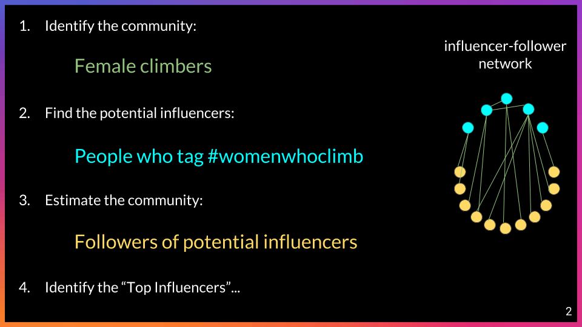
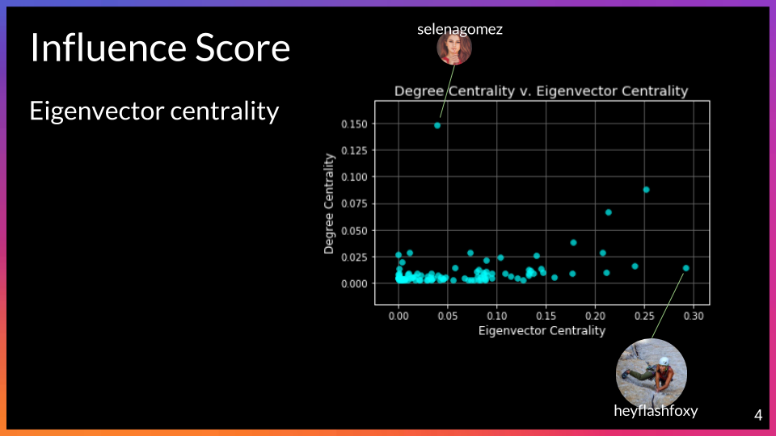
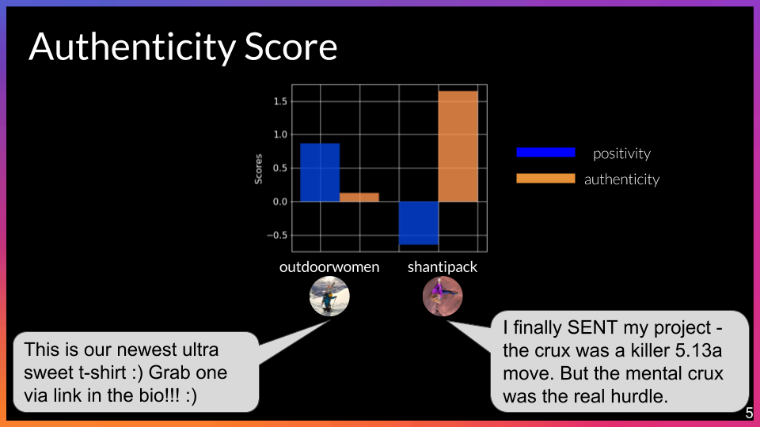
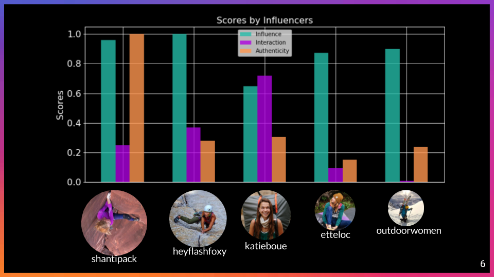

## tl;dr
Power-Middle influencers on Instagram are a more effective and authentic option for marketing niche products to targeted communities. I created a methodology to select, construct, and analyze community networks within Instagram. Elite Power-Middle influencers were identified using social centrality measures and sentiment analysis of captions. Technologies used include Python, NetworkX, MongoDB, Selenium, and vaderSentiment.

## File Structure Summary
Directory | Description
------------ | -------------
data | selected graphs and dictionaries used in this project
graph_util | scripts for creating graphs and calculating centralities
images | EDA and README figures
src | script for pipeline to calculate top influencers
webscrape_util | scripts for requesting/scraping the GraphQL API

## Business Question

Requesting promotion of a product from a celebrity with a large (millions) social media following is not just expensive - it is obvious to followers that they have been solicited to sponsor certain brands or items, and therefore seems less authentic. To market to a smaller, targeted audience, it is more affordable and effective to identify a “power-middle” influencer. These influencers will be more influential to their intimate and loyal following they have amassed.

How do you find power-middle influencers who will be the most influential to the group of people you are trying to target?

## Data Understanding and Preparation

### General Outline of Data Collection:

 - Choose a community: Take female climbers for instance.
 - Identify potential power-middle influencers: Find people who posted content with the hashtag #womenwhoclimb on Instagram (using requests, see webscrape_util/instascrape.py).
 - Estimate the rest of the community: Find people influenced by the influencers, therefore find people who followed these potential influencers (using selenium, see webscrape_util/followscrape.py).

### Conceptualization:
A social network graph (Digraph in NetworkX, graph_util/make_graph.py) is constructed using the influencers and followers. This graph can be used to identify power-middle influencers and other interesting features about the community.
* Number of nodes: 2268840
* Number of edges: 3582464
* Number of potential influencers: 1775

## Modeling

### Assumptions about Top Power-Middle Influencers:
- They have a *critical mass* following so that enough people will view their content.
- They *interact* with their community so followers are more likely to like or comment on posts.
- They *influence* a distinct community, therefore they are not just a celebrity with millions of random followers.
- They post *authentic* content and are not obviously marketing in an insincere way.

### Modeling to Identify Top Power-Middle Influencers:
- *Critical Mass Filter*: influencers must have more than 5000 followers.

- *Interaction Score*: equal to the ratio of likes to followers.

- *Influencer Score*: equal to eigenvector centrality which gives higher scores to influencers who are connected to other key members of the community.

- *Authenticity Score*: inversely proportional to the positive sentiment in their captions with the assumptions that marketing text is often overly positive and followers are more likely to trust influencers that are more candid.

Those scores are weighted and summed to determine an overall score:

## Evaluation
Performance was evaluated by:
- Determining if top influencers were already endorsing products, meaning that industry experts had deemed them to be influencers already.
- Checking if top influencers on the leaderboard have posts which show up in the "top results" of the search page for the #womenwhoclimb hashtag, which shows trending content.
